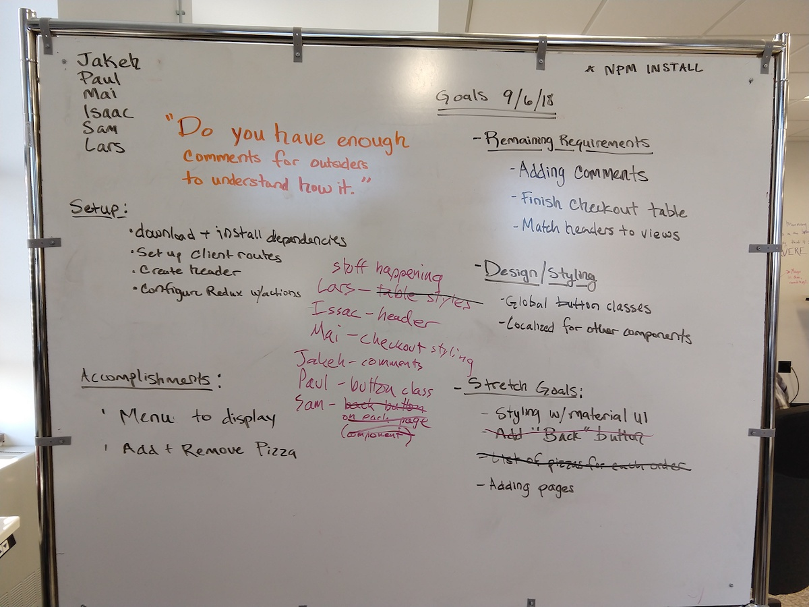
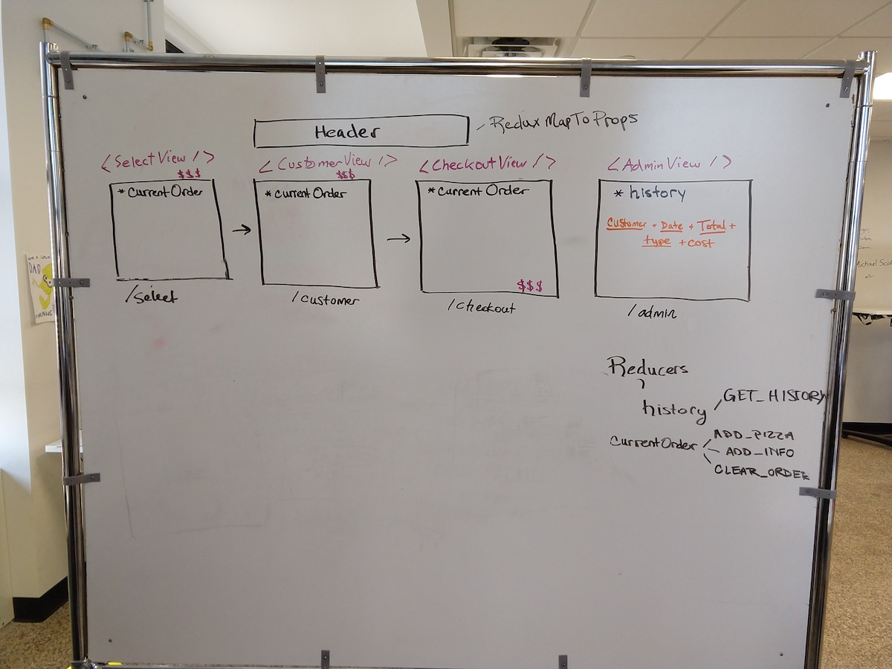

# React Pizza Parlor

Before you get started make sure to read through **ALL** requirements and outline a plan for your group. Assign out tasks and use branches to allow team members to work in parallel.

### Setup

Server side code for baseline functionality has been provided for you. Each member of your team will need to import the list of pizzas into your Mongo Database. Make sure mongo is running `mongod`, open this project folder in terminal and run the following command:

**Import data**
##Pizza Goat

A React.js application for ordering pizzas.

### Technology Used
* Javascript / HTML / CSS
* React.js
* Redux
* MongoDB
* Mongoose
* Robo3T
* Express
* Node.js
* Momentjs

### Process Shots


### Screenshot

### Setup
**Terminal**

```
mongod
```
**Import data**

```
mongoimport --db pizza_parlor --collection pizzas --file pizza.csv --type csv --headerline
```

Remember, Mongo creates the database and collections automatically! There is no need to do any additional database work after importing the pizzas. Use `cmd` + `r` in Robo 3T to refresh your list of databases. `pizza_parlor` should now appear in that list.

**Start your server**

```
npm install
npm run server
```

Now that the server is running, open a new terminal tab with `cmd + t` and start the react client app.

**Start your client**

```
npm run client
```

## API DOCS

After starting up the server, the following routes should be available. You can test them with Postman.

### GET PIZZA  

`/api/pizza`

**Returns** an array of objects with *_id*, *name*, *description*, *image_path* and *cost* properties. 

### POST ORDER

`/api/order`

**Post Data** should be an object that contains user information, *name*, *street address*, *city*, *zip*, *order_total* and an array of pizza id's as object. 

**Example Post Data:**

```JavaScript
{
    customer: { 
        name: "Chris",
        street_address: "123 street",
        city: "Minneapolis",
        zip: 55408
    },
    pizzas: [{ 
        _id: "5afc94b8c62836fadd80496c" // _id of pizza, yours will be different!
        name: "Pepperoni",
        description: "Classic pizza with cheese and pepperoni. Baked with a traditional crust in our brick oven.",
        cost: "14.99"
    },
    { 
        _id: "5afc94f3c62836fadd804979"  // _id of pizza, yours will be different!
        name: "Splat of Marinara",
        description: "Cheeseless pizza with marinara, garlic and red peppers.",
        cost: "12.99"
    }],
    order_total: 27.98,
    type: "Pickup"
}
```

### GET ORDERS

`/api/order`

**Returns** an array of orders.


